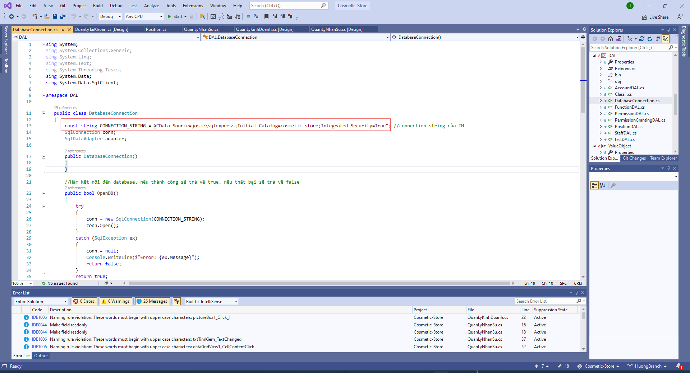

# Cosmetic Store Application

Cosmetic store app is a simple application built in C# language. The application makes managing cosmetic store operations easy and organized. The system will include 4 main functions: Sales management, human resource management, warehouse management, and access management.

## Installation

1. Import the latest file .bacpac into SQL Server Management System (or file . SQL into your Database Management System which you use).

2. Open Visual Studio to change the database connection string, following these steps.
Choosing Tool tab => Connect to Database
\
After that, an Ad Connection appears, we enter the Server name and choose the appropriate Database name, and click advance.\
\
After that, Advance properties appear, and we copy the database connection following\
\
Then, we change CONNECTION_STRING var in DatabaseConnection.cs file in DAL folder.\
\
Finally, we can run program.cs file to operate the application.
